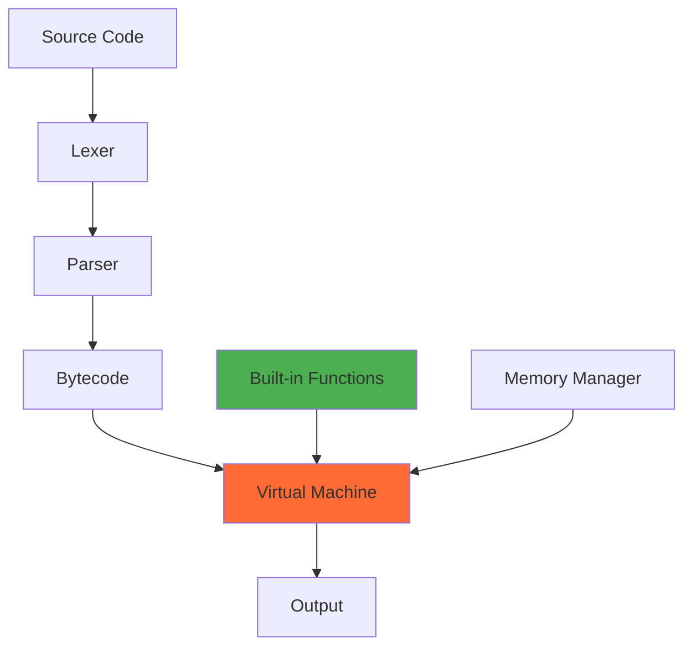

# Ember Core

<!-- Badges Section -->
[](LICENSE)
[](#)
[](VERSION)

> Core interpreter for the Ember programming language with working expression evaluation, control flow, and built-in functions

⚠️ **Development Status**: Core language features are working and stable. User-defined functions and OOP features are in development.

## Table of Contents

- [Overview](#overview)
- [Features](#features)
- [Installation](#installation)
- [Quick Start](#quick-start)
- [Usage](#usage)
- [API Reference](#api-reference)
- [Examples](#examples)
- [Contributing](#contributing)
- [Testing](#testing)
- [Architecture](#architecture)
- [License](#license)

## Overview

Ember Core is the foundational interpreter for the Ember programming language, written in C. It provides a stack-based virtual machine, recursive descent parser, and comprehensive built-in function library. The interpreter supports dynamic typing, expression evaluation, control flow, and standard library functions.

### Key Characteristics
- **Dynamic typing** with runtime type checking
- **Stack-based VM** for efficient bytecode execution  
- **Memory safe** with comprehensive input validation
- **Security hardened** with compiler-level protections

## Features

### ✅ Working Features
- **Expression Evaluation**: Arithmetic operations with proper precedence and type coercion
- **Variable System**: Dynamic typing with global scope and runtime type checking
- **Control Flow**: Complete if/else, while loops, for loops, and break statements
- **Data Types**: Numbers, strings, booleans, arrays, and null values with full support
- **Built-in Functions**: Comprehensive library including math, type conversion, I/O, and crypto
- **String Operations**: Concatenation, conversion, and manipulation functions
- **Array Support**: Dynamic arrays with indexing, length checking, and manipulation
- **File I/O**: Read, write, and append operations with error handling
- **JSON Support**: Parse and stringify with full object/array support
- **Cryptography**: SHA-256 hashing with secure implementations

### 🚧 In Development
- **User Functions**: Function definitions with parameters and local scope
- **Logical Operators**: &&, ||, ! operators for boolean expressions
- **Enhanced Error Handling**: Better error messages and recovery
- **Module System**: Import/export functionality for code organization

### 📋 Planned Features
- **Object-Oriented Programming**: Classes, methods, inheritance
- **Exception Handling**: try/catch blocks with proper stack unwinding
- **Advanced Data Structures**: Maps, sets, and custom types
- **Performance Optimizations**: JIT compilation and memory pool management

### Related Components

This repository is part of the Ember Platform:

- **[ember-native](../ember-native)** - Native extensions and standard library
- **[emberweb](../emberweb)** - Web server integration (in development)
- **[ember-tools](../ember-tools)** - Development tools and utilities
- **[ember-tests](../ember-tests)** - Comprehensive test suite
- **[ember-docs](../ember-docs)** - Platform documentation

## Installation

### Prerequisites

```bash
# Ubuntu/Debian
sudo apt-get install build-essential libreadline-dev libssl-dev pkg-config

# Arch Linux  
sudo pacman -S gcc readline openssl pkg-config

# macOS
brew install readline openssl pkg-config
```

### From Source

```bash
# Clone the repository
git clone https://github.com/emberplatform/ember-core.git
cd ember-core

# Build the interpreter
make clean && make

# Test installation
echo 'print("Hello, Ember!")' | ./build/ember
```

### Verify Installation

```bash
# Check version
./build/ember --version

# Run basic test
./build/ember working_features_test.ember
```

## Quick Start

### Basic Usage

```javascript
// hello.ember
print("Hello, Ember!")
name = "Developer"
age = 25
print("Welcome, " + name + "! You are " + str(age) + " years old.")
```

### Run the Example

```bash
./build/ember hello.ember
```

### Expected Output

```
Hello, Ember!
Welcome, Developer! You are 25 years old.
```

## Usage

### Interactive Mode

```bash
# Start interactive REPL
./build/ember

# Try some commands
> x = 42
> y = x * 2
> print("Result: " + str(y))
Result: 84
```

### Script Execution

```bash
# Run a script file
./build/ember script.ember

# Run with verbose output (if available)
./build/ember --verbose script.ember
```

### File Processing

```javascript
// file_example.ember
content = "Hello from Ember!"
success = write_file("output.txt", content)
if (success) {
    read_content = read_file("output.txt")
    print("File contains: " + read_content)
}
```

## Examples

### Example 1: Basic Arithmetic and Variables

```javascript
// arithmetic.ember
print("=== Arithmetic Demo ===")

// Variables and calculations
a = 15
b = 4
result = a + b * 3  // Operator precedence: 15 + 12 = 27

print("a = " + str(a))
print("b = " + str(b))
print("a + b * 3 = " + str(result))

// Type conversions
text_num = "123"
converted = num(text_num)
print("Converted '" + text_num + "' to number: " + str(converted))
```

### Example 2: Arrays and Control Flow

```javascript
// arrays.ember
print("=== Array and Control Flow Demo ===")

numbers = [10, 25, 30, 15, 40]
print("Numbers: " + str(numbers))
print("Array length: " + str(len(numbers)))

// Find maximum using control flow
max_val = numbers[0]
for i = 1; i < len(numbers); i = i + 1 {
    if numbers[i] > max_val {
        max_val = numbers[i]
    }
}
print("Maximum value: " + str(max_val))

// Count even numbers
even_count = 0
for i = 0; i < len(numbers); i = i + 1 {
    if mod(numbers[i], 2) == 0 {
        even_count = even_count + 1
    }
}
print("Even numbers: " + str(even_count))
```

### Example 3: File I/O and JSON

```javascript
// file_json.ember
print("=== File I/O and JSON Demo ===")

// Create some data
user_data = {
    "name": "Alice",
    "age": 30,
    "skills": ["JavaScript", "Python", "Ember"]
}

// Convert to JSON and save
json_string = json_stringify(user_data)
print("JSON data: " + json_string)

success = write_file("user.json", json_string)
if (success) {
    print("Data saved to user.json")
    
    // Read it back
    file_content = read_file("user.json")
    loaded_data = json_parse(file_content)
    
    print("Loaded name: " + loaded_data.name)
    print("Loaded age: " + str(loaded_data.age))
}
```

### Example 4: Cryptography and Security

```javascript
// crypto.ember
print("=== Cryptography Demo ===")

// Hash some data
original_data = "sensitive information"
hash_result = sha256(original_data)

print("Original: " + original_data)
print("SHA-256: " + hash_result)

// Verify data integrity
verification_hash = sha256(original_data)
if (hash_result == verification_hash) {
    print("Data integrity verified!")
} else {
    print("Data integrity check failed!")
}

// Hash different data
test_hashes = []
test_data = ["hello", "world", "ember", "crypto"]

for i = 0; i < len(test_data); i = i + 1 {
    hash = sha256(test_data[i])
    print("SHA-256 of '" + test_data[i] + "': " + hash)
}
```

More examples available in the [examples directory](examples/) and [complete documentation](https://docs.emberplatform.org/examples/).

## API Reference

For complete API documentation, see the [Core API Reference](https://docs.emberplatform.org/api/core).

### Quick Reference

```javascript
// Output and debugging
print(value, ...)              // Print values to stdout
type(value)                    // Get type as string

// Type conversion
str(value)                     // Convert to string
num(string)                    // Convert string to number
int(number)                    // Convert to integer
bool(value)                    // Convert to boolean

// Math functions
abs(number)                    // Absolute value
sqrt(number)                   // Square root
max(a, b, ...)                 // Maximum value
min(a, b, ...)                 // Minimum value
floor(number)                  // Round down
ceil(number)                   // Round up
pow(base, exponent)            // Power
mod(dividend, divisor)         // Modulo

// Array functions
len(array)                     // Array length

// File I/O
read_file(filename)            // Read file contents
write_file(filename, content)  // Write to file
append_file(filename, content) // Append to file

// JSON operations
json_parse(json_string)        // Parse JSON string
json_stringify(value)          // Convert to JSON

// Cryptography
sha256(data)                   // SHA-256 hash

// Boolean logic
not(value)                     // Logical NOT
```

## Contributing

We welcome contributions! Please see our [Contributing Guide](CONTRIBUTING.md) for details on:

- [Code of conduct](CODE_OF_CONDUCT.md)
- [Development setup](#development-setup)
- [Testing requirements](#testing)
- [Pull request process](#pull-requests)

### Development Setup

```bash
# Fork and clone the repository
git clone https://github.com/YOUR_USERNAME/ember-core.git
cd ember-core

# Install development dependencies
sudo apt-get install build-essential libreadline-dev libssl-dev valgrind

# Build in development mode
make clean && make

# Run tests
make test
```

### Pull Requests

1. Fork the repository
2. Create a feature branch: `git checkout -b feature/amazing-feature`
3. Make your changes with tests
4. Ensure all tests pass: `make test`
5. Commit your changes: `git commit -m 'feat: add amazing feature'`
6. Push to the branch: `git push origin feature/amazing-feature`
7. Open a Pull Request

## Testing

### Running Tests

```bash
# Run all tests
make test

# Run basic functionality tests
./build/ember working_features_test.ember

# Run memory safety tests
make ASAN=1 && ./build/ember test_memory.ember

# Run control flow tests
./build/ember test_control_flow_simple.ember
```

### Test Structure

```
tests/
├── unit/               # Unit tests for individual components
├── integration/        # Integration tests
└── fuzz/              # Fuzzing tests for security
```

## Architecture

### Component Overview



### Core Components

- **Virtual Machine (`src/core/vm.c`)**: Stack-based bytecode interpreter with security hardening
- **Parser (`src/frontend/parser/`)**: Recursive descent parser supporting full language syntax
- **Lexer (`src/frontend/lexer/`)**: Token scanner with comprehensive error handling
- **Runtime (`src/runtime/`)**: Built-in functions and standard library integration
- **Memory Management (`src/core/memory.c`)**: Secure memory allocation with leak detection

### Implementation Characteristics

- **Security First**: Comprehensive input validation and memory safety
- **Dynamic Typing**: Runtime type checking with automatic conversions
- **Stack-based VM**: Efficient bytecode execution with minimal overhead
- **Global Scope**: Simple variable model (local scope planned)
- **Comprehensive Error Handling**: Clear error messages with context

### Performance Characteristics

- **Startup Time**: Fast interpreter initialization
- **Memory Usage**: Conservative memory allocation
- **Execution Speed**: Optimized for development and testing
- **Security**: Hardened against common vulnerabilities

For detailed architecture documentation, see [docs/architecture/](docs/architecture/).

## Troubleshooting

### Common Issues

#### Build Warnings
**Issue**: Compilation warnings during build
**Solution**: The build succeeds despite warnings; warnings are being addressed

```bash
# Build will succeed with warnings
make clean && make
```

#### Continue in For Loops
**Issue**: `continue` statements in for loops cause infinite loops
**Solution**: Use `break` or avoid `continue` in for loops

```javascript
// Avoid this pattern
for i = 0; i < 10; i = i + 1 {
    if i == 5 {
        continue  // This causes infinite loop
    }
    print(i)
}

// Use this instead
for i = 0; i < 10; i = i + 1 {
    if i != 5 {
        print(i)
    }
}
```

#### Memory Issues
**Issue**: Potential memory leaks or crashes
**Solution**: Use AddressSanitizer for debugging

```bash
make ASAN=1
./build/ember script.ember
```

### Getting Help

- **Documentation**: [Ember Platform Documentation](https://docs.emberplatform.org)
- **Issues**: [GitHub Issues](https://github.com/emberplatform/ember-core/issues)
- **Examples**: Check working examples in repository
- **Community**: [GitHub Discussions](https://github.com/emberplatform/ember/discussions)

## Roadmap

### Current Version: 2.0.3
- Core language features stable
- Basic standard library functions working
- Security improvements implemented
- Documentation updated for accuracy

### Next Release: 2.1.0 (Planned)
- User-defined functions with parameters
- Logical operators (&&, ||, !)
- Enhanced error handling
- Local variable scoping

### Future Plans
- Object-oriented programming features
- Module system and imports
- Exception handling with try/catch
- Performance optimizations

For detailed roadmap, see [ROADMAP.md](ROADMAP.md) or the [project roadmap](https://docs.emberplatform.org/roadmap/).

## License

This project is licensed under the MIT License - see the [LICENSE](LICENSE) file for details.

## Support

### Reporting Issues

Please report issues using our [issue template](.github/ISSUE_TEMPLATE.md):

1. **Bug reports**: Use the bug report template
2. **Feature requests**: Use the feature request template
3. **Security issues**: Email security@emberplatform.org

### Community

- **GitHub Discussions**: [Project discussions](https://github.com/emberplatform/ember/discussions)
- **Documentation**: [Official docs](https://docs.emberplatform.org)
- **Contributing**: [Contribution guidelines](CONTRIBUTING.md)

---

**Ember Core** - Core interpreter for the Ember programming language with working expression evaluation, control flow, and built-in functions.